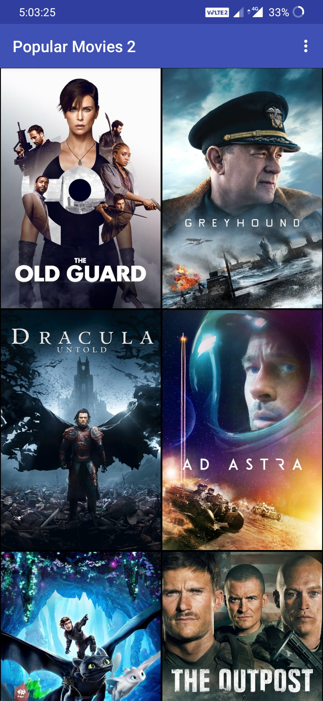
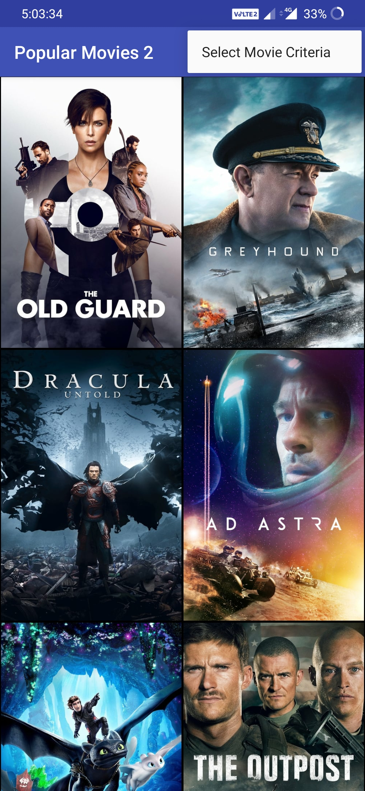
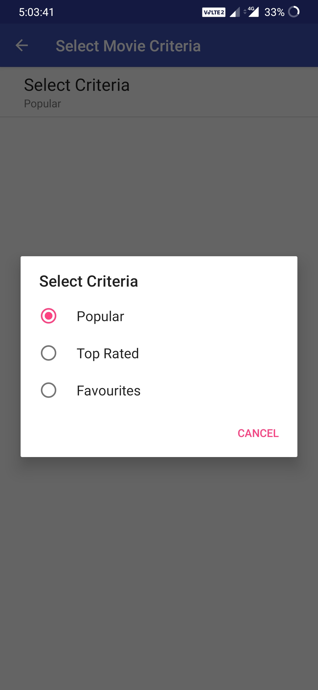
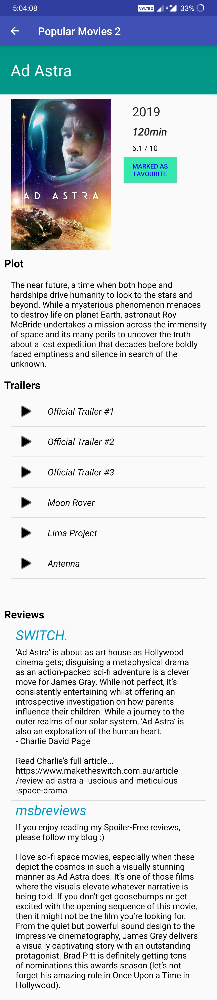
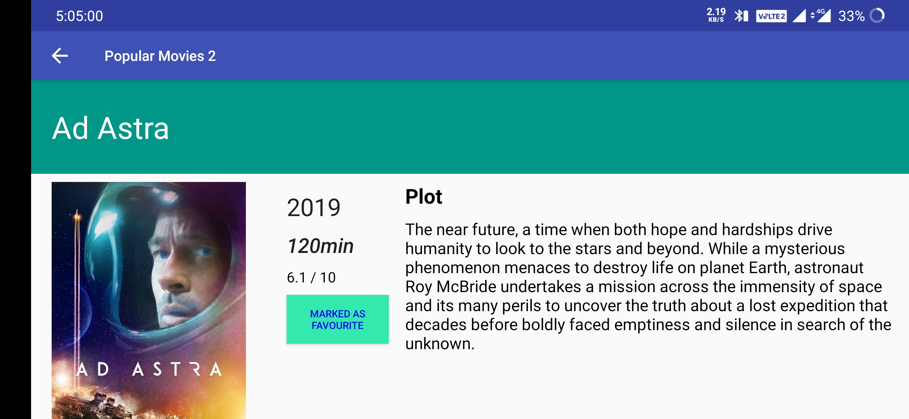

# UdacityAndroidNanodegree-PopularMovieS
 Popular Movies android app 

****Concepts Covered***
- Simple and complex Recycler Views
- Preference Fragment and Shared Preferences
- Content Providers (custom)
- Saving into database using SQLiteHelper and Contract classes
- Constraint Layout (Portrait and Landscape)
- Building URL from Uri and HttpURLConnection
- Parse raw JSON string(using JSONObject)

***App's Functionality Youtube Video Link -> https://youtu.be/UTP_IZD2YY8***

## App Screens

***Movies List***

---

***Movie Criteria Select***

---

***Movie Details (Portrait)***

---

***Movie Details (Landscape)***

---
## License

This project is licensed under the Apache License 2.0 - see the [LICENSE.md](LICENSE) file for details